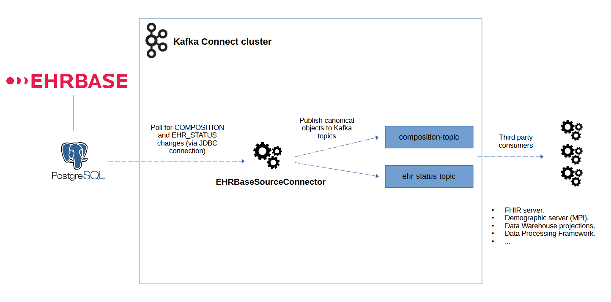
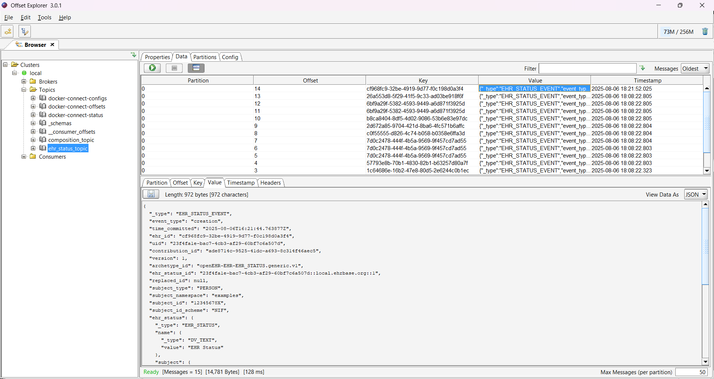

# About

The EHRbase source connector enables the import of change logs for "COMPOSITION" and "EHR_STATUS" contributions stored on an EHRbase server into Kafka topics. System events — such as creations, modifications, or deletions — are retrieved by periodically executing SQL queries directly on the EHRbase server’s PostgreSQL database via a JDBC connection. These queries explore the relevant EHRbase tables in chronological order to process changes from oldest to newest. For each retrieved change, the corresponding version of the canonical object is reconstructed with the EHRbase SDK and published to the Kafka topics. Once the complete server history has been imported, the connector continues running periodically to capture and import new changes as they occur.



# Requirements

- [EHRbase (Community Edition)](https://www.ehrbase.org/) versions >= 2.0.0
- [Kafka Connect](https://kafka.apache.org/) (versions >= 4.0.0) or [Confluent Platform](https://www.confluent.io/) (versions >= 8.0.0), both compatible with Java 21.  
  Note: The connector depends on the EHRbase SDK and is currently only available for Java 21.
- If you want to build the connector, you will need [Apache Maven](https://maven.apache.org/) and a [JDK 21](https://adoptium.net/)

# Installing and Running the Connector

## Build

You can build the connector using the command `mvn clean package assembly:single`.

After building, you'll find the Kafka Connect installation bundle as a ZIP file in the directory `./target/kafka-connect-ehrbase-x.x.x-bundle.zip`

If you prefer not to build the connector yourself, a pre-built bundle is available in the `./build` directory of this repository.

## Installing the Connector in Kafka Connect

Installation consists of copying the contents of the ZIP file into the Kafka Connect plugin directory, which is typically located at `/usr/share/plugins`.
In the `./cluster` directory of this repository, you can find an example of a complete setup (EHRbase, PostgreSQL, Kafka, Kafka Schema Registry and Kafka Connect) that can be run using the command `docker compose up -d`.
Make sure to correctly configure the volume paths where the connector will be copied:

```
...
  connect:
    image: confluentinc/cp-kafka-connect:8.0.0
...
    volumes:
      - ./plugins:/usr/share/plugins
    environment:
      CONNECT_PLUGIN_PATH: "/usr/share/java,/usr/share/confluent-hub-components,/usr/share/plugins"
...
```

In the previous example, in the `./plugins` directory, the connector would have the following structure once the bundle has been extracted from the ZIP:

```
plugins/
  kafka-connect-ehrbase-0.1.0/
    assets/
    etc/
    lib/
    manifest.json
```

## Running the Connector

The easiest way to interact with the connector is through the Kafka Connect API.

If the connector has been installed correctly, running the following command will display it in the list of available plugins:

```bash
curl --location 'http://localhost:8083/connector-plugins'
```

Example output:

```
[
    {
        "class": "com.github.joselalvarez.openehr.connect.EHRBaseSourceConnector",
        "type": "source",
        "version": "0.1.0"
    },
    {
        "class": "org.apache.kafka.connect.mirror.MirrorCheckpointConnector",
        "type": "source",
        "version": "8.0.0-ccs"
    },
    {
        "class": "org.apache.kafka.connect.mirror.MirrorHeartbeatConnector",
        "type": "source",
        "version": "8.0.0-ccs"
    },
    {
        "class": "org.apache.kafka.connect.mirror.MirrorSourceConnector",
        "type": "source",
        "version": "8.0.0-ccs"
    }
]
```

To start an instance of the connector, execute the following command:

```bash
curl --location 'http://localhost:8083/connectors' \
--header 'Content-Type: application/json' \
--data '{
  "name": "my-ehrbase-connector",
  "config": {
    "name": "my-ehrbase-connector",
    "connector.class": "com.github.joselalvarez.openehr.connect.EHRBaseSourceConnector",
    "tasks.max": "2",
    "value.converter": "com.github.joselalvarez.openehr.connect.JsonConverter",
    "kafka.composition.topic": "composition_topic",
    "kafka.ehr.status.topic": "ehr_status_topic",
    "poll.batch.size": 100,
    "database.jdbc.url": "jdbc:postgresql://ehrdb:5432/ehrbase",
    "database.username": "ehrbase",
    "database.password": "ehrbase",
    "database.schema": "ehr"
  }
}'
```

To check the status of the connector, run:

```bash
curl --location 'http://localhost:8083/connectors/my-ehrbase-connector/status'
```

Example output:

```
{
    "name": "my-ehrbase-connector",
    "connector": {
        "state": "RUNNING",
        "worker_id": "connect:8083"
    },
    "tasks": [
        {
            "id": 0,
            "state": "RUNNING",
            "worker_id": "connect:8083"
        },
        {
            "id": 1,
            "state": "RUNNING",
            "worker_id": "connect:8083"
        }
    ],
    "type": "source"
}
```

If everything is working correctly, we should be able to see messages appearing in the topics we have configured:




For more information about the Kafka Connect API, refer to the [documentation](https://docs.confluent.io/platform/current/connect/references/restapi.html).

## Improving Read Performance with Indexes 

The SQL queries used to extract the change log can be found in the following files:  

- [Composition changes SQL](src/main/resources/sql/find-composition-change-agg-list.sql)  
- [EHR status changes SQL](src/main/resources/sql/find-ehr-status-change-agg-list.sql)  

At the core of both queries is an ordered and paginated scan of the `audit_details` table.  
To improve sorting performance, it is recommended to create an index on the `time_committed` field:  

```sql
CREATE INDEX audit_details_time_committed_idx ON ehr.audit_details (time_committed);
```

# Message format

## COMPOSITION_EVENT

Message key: `ehr_id`

| Field           | Type        | Description                                                              |
|----------------|-------------|---------------------------------------------------------------------------|
| _type          | string      | Object type, always `COMPOSITION_EVENT`.                                   |
| event_type     | string      | Type of event: `creation`\|`modification`\|`deleted`.                      |
| time_committed | string      | Date when the composition was persisted (ISO 8601 format).                 |
| ehr_id         | string      | Identifier of the EHR.                                                     |
| uid            | string      | UUID of the composition.                                                   |
| contribution_id| string      | Identifier of the contribution.                                            |
| version        | int         | Version number of the composition.                                         |
| archetype_id   | string      | Archetype ID of the composition.                                           |
| template_id    | string      | Template ID used to generate the composition.                              |
| composition_id | string      | Object Version ID of the composition (`ObjectVersionID`).                  |
| replaced_id    | string      | Object Version ID of the composition being replaced (if applicable).       |
| composition    | bytes/json  | Canonical serialized composition (e.g., AVRO Schema or JSON, depending on the converter used).  |

Example:

```
{
  "_type": "COMPOSITION_EVENT",
  "event_type": "modification",
  "time_committed": "2024-08-12T14:05:25.51065Z",
  "ehr_id": "57793e8b-70b1-4830-82b1-b63257d80a7f",
  "uid": "bc4d3912-d01a-4405-b31a-e80880f8a504",
  "contribution_id": "1de07749-a983-4666-b45e-7a9a3e7cfaf0",
  "version": 3,
  "archetype_id": "openEHR-EHR-COMPOSITION.health_summary.v1",
  "template_id": "International Patient Summary",
  "composition_id": "bc4d3912-d01a-4405-b31a-e80880f8a504::local.ehrbase.org::3",
  "replaced_id": "bc4d3912-d01a-4405-b31a-e80880f8a504::local.ehrbase.org::2",
  "composition": {...}
}
```

## EHR_STATUS_EVENT

Message key: `ehr_id`

| Field              | Type        | Description                                                                                           |
|-------------------|-------------|-------------------------------------------------------------------------------------------------------|
| _type             | string      | Object type, always `EHR_STATUS_EVENT`.                                                                |
| event_type        | string      | Type of event: `creation`\|`modification`.                                                             |
| time_committed    | string      | Date when the EHR status was persisted (ISO 8601 format).                                              |
| ehr_id            | string      | Identifier of the EHR.                                                                                 |
| uid               | string      | UUID of the EHR status.                                                                                |
| contribution_id   | string      | Identifier of the contribution.                                                                        |
| version           | int         | Version number of the EHR status.                                                                      |
| archetype_id      | string      | Archetype ID of the EHR status.                                                                        |
| ehr_status_id     | string      | Object Version ID of the EHR status (`ObjectVersionID`).                                               |
| replaced_id       | string      | Object Version ID of the replaced EHR status, if applicable.                                           |
| subject_type      | string      | Type of the subject associated with the EHR (e.g., `PERSON`, `ORGANISATION`).                         |
| subject_namespace | string      | Namespace used to resolve the subject ID (e.g., `ehr::default::system`).                              |
| subject_id        | string      | Identifier of the subject (e.g., person ID).                                                           |
| subject_id_scheme | string      | Identification scheme used for the subject (e.g., `id_scheme`, `nhs_number`, etc.).                   |
| ehr_status        | bytes/json  | Canonical serialized EHR status (e.g., AVRO Schema or JSON, depending on the converter used).         |


Example:

```
{
  "_type": "EHR_STATUS_EVENT",
  "event_type": "creation",
  "time_committed": "2024-08-12T13:49:38.403675Z",
  "ehr_id": "2b126607-e56d-43d3-8a60-a925f23dbb2f",
  "uid": "3c15e5ef-80a1-43ca-80cd-e282588e32d9",
  "contribution_id": "b72c95ad-8866-4aaf-b817-5a21c893f832",
  "version": 1,
  "archetype_id": "openEHR-EHR-EHR_STATUS.generic.v1",
  "ehr_status_id": "3c15e5ef-80a1-43ca-80cd-e282588e32d9::local.ehrbase.org::1",
  "replaced_id": null,
  "subject_type": "PERSON",
  "subject_namespace": "examples",
  "subject_id": "12345678Z",
  "subject_id_scheme": "NIF",
  "ehr_status": {...}
}
```

# Connector configuration options

| Field                                   | Type    | Mandatory | Description |
|-----------------------------------------|---------|-----------|-------------|
| `name`                                  | string  | yes       | Name of the connector instance. |
| `connector.class`                       | string  | yes       | Fully qualified class name of the connector: `com.github.joselalvarez.openehr.connect.EHRBaseSourceConnector`. |
| `tasks.max`                             | string  | yes       | Number of connector tasks. If greater than 1, event ordering is only guaranteed within the same `EHR` (ehr_id). The maximum allowed value is 16. |
| `value.converter`                       | string  | no        | Class used to convert messages. If not specified, Kafka Connect’s default converter (AVRO) is used. The connector also provides `com.github.joselalvarez.openehr.connect.JsonConverter` for plain JSON formatting. |
| `kafka.composition.topic`               | string  | yes       | Kafka topic where composition change events are published. |
| `kafka.ehr.status.topic`                | string  | yes       | Kafka topic where EHR status change events are published. |
| `poll.interval.ms`                      | long    | no        | Minimum time between polling cycles in milliseconds. |
| `poll.batch.size`                       | long    | no        | Maximum number of records retrieved per poll. |
| `filter.composition.from.date`          | string  | no        | Start date from which compositions are retrieved (ISO 8601 format). |
| `filter.composition.to.date`            | string  | no        | End date until which compositions are retrieved (ISO 8601 format). |
| `filter.composition.by.template`        | string  | no        | Template ID of compositions to retrieve. |
| `filter.composition.by.archetype`       | string  | no        | Archetype ID of compositions to retrieve. |
| `filter.ehr.status.from.date`           | string  | no        | Start date from which EHR status entries are retrieved (ISO 8601 format). |
| `filter.ehr.status.to.date`             | string  | no        | End date until which EHR status entries are retrieved (ISO 8601 format). |
| `database.jdbc.url`                     | string  | yes       | JDBC URL of the EHRbase PostgreSQL database. |
| `database.username`                     | string  | yes       | Username for the EHRbase database connection. |
| `database.password`                     | password| yes       | Password for the EHRbase database connection. |
| `database.schema`                       | string  | no        | Database schema name used by EHRbase. |

